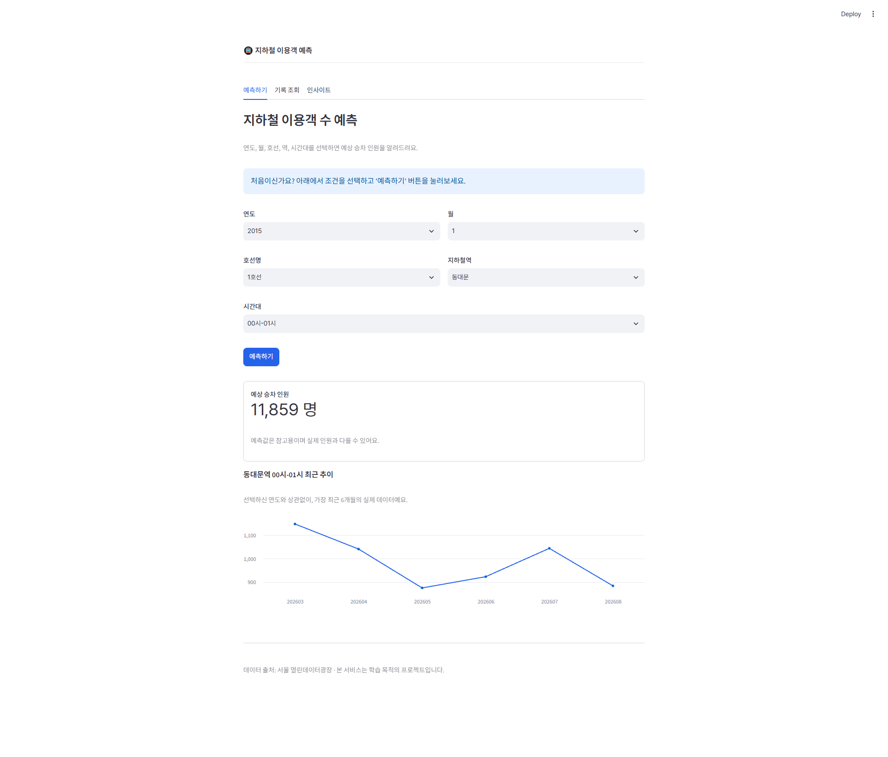
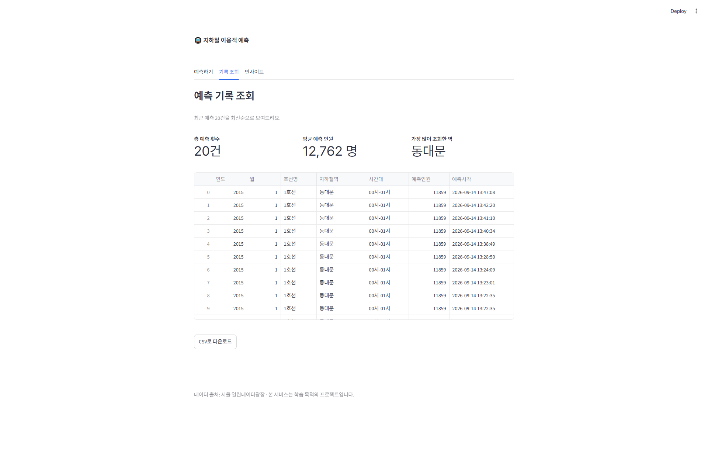
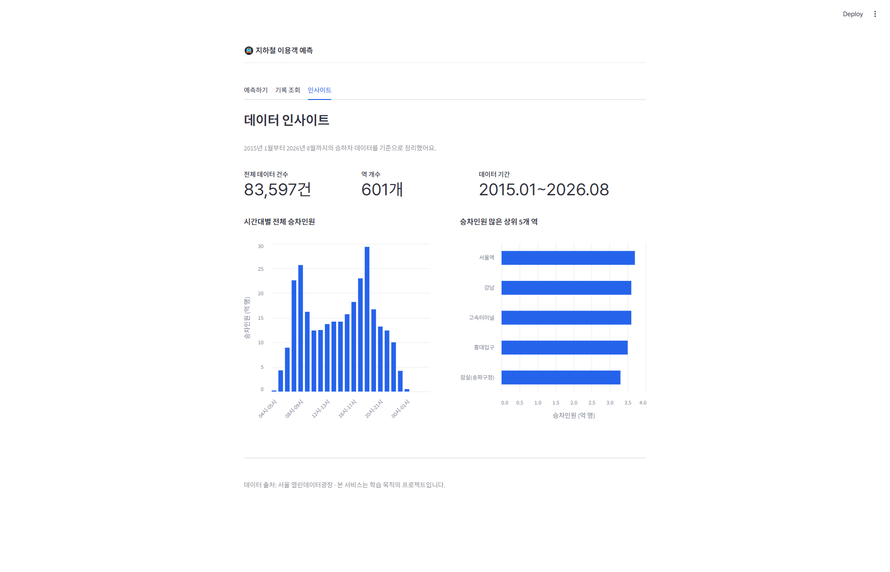

# 지하철 이용객 수 예측

## 프로젝트 소개
서울시 지하철 시간대별 승하차 데이터를 활용해, 연도/월/호선/역/시간대 조건에 따른
예상 승차 인원을 예측하는 머신러닝 웹 서비스입니다.

## 문제 정의
역·시간대별 지하철 이용객 수를 미리 알 수 있다면 어떨까라는 질문에서 출발했습니다.
단순히 과거 데이터를 통계로 보여주는 조회형 서비스가 아니라, 머신러닝으로
미래 승차 인원을 예측하는 서비스를 만드는 것을 목표로 했습니다.

## 데이터 소개
- **출처**: 서울 열린데이터광장 - 지하철 시간대별 승하차 인원
- **원본 규모**: 84,838건 (호선/역/월별 집계, 시간대별 24개 컬럼)
- **정제 후 규모**: 83,597건 (완전 중복 행 1,241건 제거)
- **역 개수**: 601개
- **호선 개수**: 28개
- **기간**: 2015년 1월 ~ 2026년 8월 (140개월)

## EDA 결과
- 시간대별 전체 승차인원을 집계한 결과, 출근 시간대(08~09시)와 퇴근 시간대(18~19시)에
  뚜렷한 피크가 나타났습니다.
- 역별 승차인원 합계 기준 상위 역은 서울역, 강남, 고속터미널, 홍대입구, 잠실 순이었습니다.
- 승차인원 데이터는 0명부터 최대 448,390명까지 분포하며, 한쪽으로 크게 쏠린 분포를
  보였습니다. 이 점은 이후 모델 성능(오차) 해석에도 반영했습니다.

## 전처리 과정
1. **중복 제거**: 완전 중복 행 1,241건 제거
2. **형태 변환**: 원본은 시간대별 승차인원이 24개 컬럼으로 넓게 퍼져 있는 wide 형태였는데,
   이를 `(연도, 월, 호선명, 지하철역, 시간대, 승차인원)` 구조의 long 형태로 변환
3. **Feature 확정**: 당초 "요일"을 조건에 포함하려 했으나, 원본 데이터가 월 단위로
   집계되어 있어 요일 정보 자체가 존재하지 않음을 확인. 최종적으로 연도, 월, 호선명,
   지하철역, 시간대 5개 변수로 확정
4. **인코딩**: 호선명·지하철역·시간대를 원-핫 인코딩. 컬럼이 653개까지 늘어나
   밀집 배열로 처리 시 200만 행 기준 약 9.76GB 메모리가 필요해, scipy의 희소행렬
   (sparse matrix)로 처리
5. **분할**: 연도·월 기준 정렬 후 80:20으로 학습/테스트 데이터 분할 (시계열 특성을
   고려해 미래 시점 예측 성능을 검증)

## 머신러닝 모델
- **알고리즘**: RandomForestRegressor (scikit-learn)
- **하이퍼파라미터**: n_estimators=30, max_depth=15, random_state=42
- **평가 지표**:

| 지표 | 값 | 의미 |
|---|---|---|
| R² | 0.632 | 전체 변동의 63.2%를 모델이 설명 |
| MAE | 8,345 | 평균 절대 오차 (명) |
| RMSE | 13,581 | 평균 제곱근 오차 (명) |

승차인원 데이터가 한쪽으로 쏠린 분포라, 값이 큰 러시아워·주요역일수록
예측 오차가 커지는 경향이 있습니다.

## 사용 기술
- 데이터: 서울 열린데이터광장 - 지하철 시간대별 승하차 인원
- 머신러닝: scikit-learn (RandomForestRegressor)
- 웹: Streamlit
- 데이터베이스: MongoDB
- 화면 설계: Figma
- AI 협업: Claude (Anthropic) — 코드 작성 가이드, 디버깅, 문서화 지원

## 폴더 구조
├── data/subway.csv
├── model/ (학습된 모델, 인코더, 옵션 목록)
├── ml_project_subway.ipynb (데이터 분석 및 모델 학습)
├── app.py (Streamlit 웹 앱)
└── requirements.txt

## 실행 방법
1. pip install -r requirements.txt
2. MongoDB 로컬 실행
3. streamlit run app.py

## MongoDB 연동
- **Database**: `subway_prediction`
- **Collection**: `predictions`

예측하기 화면에서 "예측하기" 버튼을 누를 때마다, 아래 형태로 문서 하나가 저장됩니다.

```json
{
  "연도": 2026,
  "월": 10,
  "호선명": "2호선",
  "지하철역": "신림",
  "시간대": "17시-18시",
  "예측인원": 66869,
  "예측시각": "2026-09-14T15:52:00"
}
```

| 필드 | 설명 |
|---|---|
| 연도, 월, 호선명, 지하철역, 시간대 | 사용자가 선택한 예측 조건 |
| 예측인원 | 모델이 예측한 승차 인원 |
| 예측시각 | 예측을 실행한 시각 |

기록 조회 화면에서는 `예측시각` 기준 내림차순으로 정렬해, 가장 최근 예측 20건을 조회해 보여줍니다.

## 주요 기능
- 예측하기: 연도/월/호선/역/시간대 선택 → 예상 승차 인원 예측
- 기록 조회: 예측 이력 확인 (MongoDB 저장)
- 인사이트: 시간대별/역별 승하차 데이터 시각화

## 화면 미리보기

### 예측 화면



### 기록 조회 화면



### 인사이트 화면

